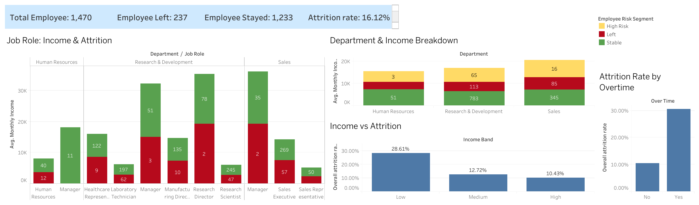

# Employee Attrition & Retention Analysis — Tableau

## Project Overview

An interactive Tableau dashboard analyzing employee attrition patterns using the IBM HR Analytics Employee Attrition & Performance dataset.

The objective of this project is to understand how factors such as income level, overtime, department, job role, and employee characteristics are associated with observed employee attrition.

## Business Problem

The HR department wants to understand employee attrition patterns and identify employee segments associated with higher observed attrition.

This analysis focuses on historical patterns and relationships in the dataset rather than predicting future employee attrition.

## Dashboard

### Key KPIs

- **Total Employees:** 1,470
- **Employees Left:** 237
- **Employees Stayed:** 1,233
- **Overall Attrition Rate:** 16.12%

### Key Findings

- Employees working **overtime** had an observed attrition rate of **30.53%**, compared with **10.44%** for employees who did not work overtime.
- Employees in the **Low Income** band had an observed attrition rate of **28.61%**.
- The observed attrition rate was **12.72%** for the Medium Income band and **10.43%** for the High Income band.
- The dashboard also provides breakdowns of income and employee attrition across departments and job roles.

> **Note:** These findings describe associations observed in the dataset and do not establish causation.

## Employee Risk Segment

A rule-based calculated field was created to explore employee segments:

- **High Risk:** Job Satisfaction < 2 and Overtime = Yes
- **Left:** Employee Attrition = Yes
- **Stable:** All other employees

This is an exploratory segmentation rule and **not a predictive attrition model**.

## Tableau Techniques Used

- KPI cards
- Calculated fields
- Attrition rate calculations
- Stacked bar charts
- Income band analysis
- Employee segmentation
- Filters and dashboard interactions
- Department and job-role analysis
- Dashboard layout and visualization

## Dataset

**IBM HR Analytics Employee Attrition & Performance**

The dataset contains employee-level information including demographics, job characteristics, compensation, satisfaction, overtime and attrition status.

## Tools

- Tableau Public
- Tableau Desktop
- IBM HR Analytics dataset

## Project Files

- `employee-attrition-dashboard.twbx` — Tableau packaged workbook
- `screenshots/employee-attrition-dashboard.png` — Dashboard screenshot

## Tableau Public

View the interactive dashboard:

[Employee Attrition & Retention Analysis | Tableau Public]
https://public.tableau.com/app/profile/vijay.rao3638/viz/employee-attrition-dashboard/Dashboard1?publish=yes

## Author

**Nischay Sharma**
